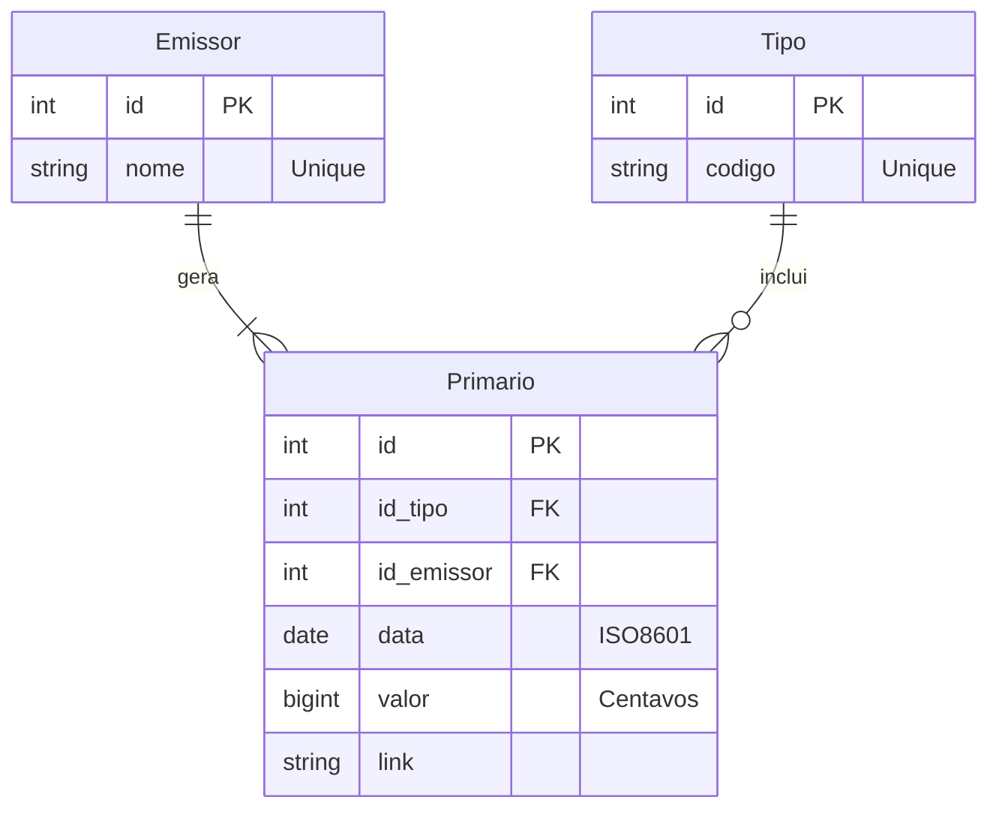

# Desafio Técnico - JGP Crédito

Este repositório contém a minha solução para o desafio técnico de estágio em desenvolvimento Fullstack na JGP Crédito.

O projeto consiste em uma aplicação completa para gestão de ofertas do mercado primário, abrangendo desde a ingestão de dados (ETL) até a visualização em um dashboard interativo.

## Como Executar

O projeto foi totalmente containerizado para garantir consistência e facilidade de execução. Você não precisa instalar Python, Node ou bibliotecas locais.

### Pré-requisitos

- **Docker** e **Docker Compose** instalados.

### Passo a Passo

1. Clone o repositório:
   ```bash
   # Com HTTPS
   git clone https://github.com/Cerne17/Desafio-Tecnico-JGP.git

   # Ou com SSH
   git clone git@github.com:Cerne17/Desafio-Tecnico-JGP.git

   cd Desafio-Tecnico-JGP
   ```
2. Suba o ambiente com um único comando:
    ```bash
    docker-compose up --build
    ```
3. Acesse a aplicação:
    * **Frontend (Interface):** http://localhost:80
    * **Backend (API):** http://localhost:3000

## Arquitetura do Projeto

Adotei uma arquitetura orientada a serviços utilizando **Docker Compose** para orquestrar três containers distintos, garantindo separação de responsabilidades:

* **ETL (Service):** Um container Python efêmero que lê o Excel, normaliza os dados e popula o banco SQLite. Ele roda uma vez e encerra.
* **Backend (API):** Um servidor Node.js/Express persistente que serve os dados via REST.
* **Frontend (Client):** Uma aplicação React servida por Nginx (via Multi-stage build) para alta performance.

**Estrutura de Diretórios**

```text
.
├── docker-compose.yml          # Orquestrador dos serviços
├── data/                       # Volume compartilhado (Persistência do SQLite)
├── backend/                    # API Node.js + Express (MVC)
│   ├── src/
│   │   ├── controllers/        # Regras de entrada/saída
│   │   ├── models/             # Queries SQL e lógica de dados
│   │   ├── routes/             # Definição de endpoints
│   │   └── lib/                # Configuração do banco
│   └── database/               # Schema SQL
├── frontend/                   # Interface Web (Vite + React + TS)
│   ├── src/
│   │   ├── components/         # UI (shadcn) e Widgets
│   │   ├── services/           # Integração com API
│   │   └── ...
└── etl/                        # Script de Ingestão de Dados
    ├── scripts/
    │   └── import_data.py      # Lógica de processamento e sanitização
    └── input/                  # Arquivos brutos (.xlsx)
```

## Stack Tecnológica

### 1. ETL (Extract, Transform, Load)

Responsável por sanitizar e estruturar os dados brutos.

* **Python 3.12:** Linguagem base.
* **Pandas:** Manipulação e limpeza de dados.
* **Openpyxl:** Leitura de arquivos .xlsx.
* **Lógica:** Normalização de emissores e tipos para garantir integridade referencial.

### 2. Backend (API)

* **Node.js & Express:** API REST performática.
* **SQLite:** Banco de dados relacional leve (requisito do desafio).
* **Arquitetura MVC:** Separação clara entre Rotas, Controllers e Models.
* **SQLite3 Driver:** Interação direta com o banco para performance.

### 3. Frontend (UI/UX)

* **React & Vite:** SPA rápida e moderna.
* **TypeScript:** Tipagem estática para maior segurança e manutenibilidade.
* **Tailwind CSS:** Estilização utilitária.
* **shadcn/ui:** Componentes acessíveis e robustos (baseados em Radix UI).
* **TanStack Table:** Gerenciamento avançado de tabelas (ordenação, filtros, paginação).
* **Recharts:** Biblioteca de gráficos para o dashboard.
* **Zod & React Hook Form:** Validação robusta de formulários.
* **Docker Multi-stage:** O container final usa Nginx para servir arquivos estáticos, simulando um ambiente de produção real.

## Modelagem do Banco de Dados

Para garantir a integridade dos dados e evitar redundâncias, normalizei a tabela original do Excel em três entidades relacionais.



**Decisões Técnicas Importantes**

1. **Valores Monetários (`bigint`):** Optei por armazenar os valores como inteiros (**centavos**) em vez de `float` ou `decimal`. Isso evita problemas clássicos de arredondamento de ponto flutuante em sistemas financeiros. O Frontend converte para visualização (`Intl.NumberFormat`), mas o banco mantém a precisão matemática.
2. **Normalização (Emissor/Tipo):** Ao separar `Emissor` e `Tipo` em tabelas próprias, evitamos redundância de texto e facilitamos estatísticas agrupadas. Se o nome de um emissor mudar, atualizamos apenas um registro.
3. **Dockerização do ETL:** O script de importação não é rodado manualmente. O Docker garante que o banco seja criado e populado automaticamente antes mesmo da API iniciar, garantindo um ambiente de teste sempre "pronto para uso".

## Funcionalidades do Frontend

A interface foi projetada para ser intuitiva e simular uma ferramenta real de gestão:

* **Dashboard Executivo:** Cards com KPIs (Total, Volume, Ticket Médio) e gráfico de barras dos maiores emissores.
* **Tabela Interativa:**
    * **Ordenação:** Clique nos cabeçalhos (Data, Valor) para ordenar.
    * **Busca Global:** Filtre por Nome do Emissor, Tipo ou ID em tempo real.
    * **Paginação:** Navegação fluida entre registros.
* **Edição Controlada:**
    * Modal para edição de ofertas.
    * Validação de dados (ex: impede valores negativos ou datas inválidas) usando **Zod**.
    * Atualização em tempo real do dashboard após edição.

## Testes Automatizados

Implementei uma suite de testes unitários para garantir a confiabilidade das regras de negócio.

### Backend (Jest)
Para rodar os testes do backend:
```bash
cd backend
npm test
```
Os testes cobrem:
* **Models:** Queries SQL, promessas e tratamento de dados.
* **Controllers:** Endpoints da API, status codes (200, 404, 500) e integração com mocks de banco.

### ETL (Pytest)
Para rodar os testes do ETL, é necessário garantir que as dependências estejam instaladas localmente:

1. Navegue até a pasta: `cd etl`
2. (Opcional) Crie e ative um ambiente virtual:
   ```bash
   python3 -m venv .venv
   source .venv/bin/activate # Linux/Mac
   .venv\Scripts\activate # Windows
   ```
3. Instale as dependências necessárias (incluindo o pytest):
   ```bash
   pip install -r requirements.txt
   ```
4. Execute os testes:
   ```bash
   pytest scripts/test_import_data.py
   ```
Os testes cobrem:
* **Limpeza de dados:** Conversão de valores monetários para centavos e formatação de datas.

## Melhorias Futuras
1. **CI/CD:** Configurar GitHub Actions para rodar linters e build automaticamente.
2. **Hospedagem:** Deploy da imagem Docker em serviço de nuvem (AWS/Render).
3. **Scraping de dados:** Extrair mais informações e checar a integridade da base de dados, buscando atualizações, para sempre ter as informações atualizadas para o cliente.

---

*Desenvolvido por Miguel Cerne*
