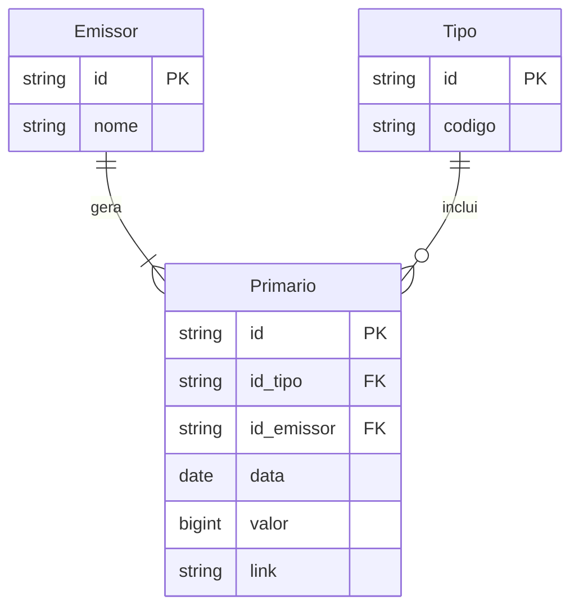

# Desafio Técnico - JGP Crédito

Este projeto é minha resolução para o desafio técnico para a vaga de estagiário em desenvolvimento para a JGP Créditos. Abaixo explico a organização das pastas, como fazer a instalação e utilizar cada componente do sistema e, posteriormente, exponho uma breve explicação teórica por trás das decisões que tomei.

O objetivo foi desenvolver uma aplicação robusta que processa dados do mercado financeiro (ETL), expõe uma API REST para consulta/edição e apresenta um Dashboard interativo.

## Organização do Projeto

Adotei uma arquitetura orientada a serviços utilizando **Docker**, garantindo isolamento de responsabilidades e facilidade de execução.

**Estrutura de Diretórios**:

Dividi o projeto em 3 partes: 

* **etl (extract, transform & load)**: responsável por estudar a estrutura dos dados fornecidos e fazer a sanitização — caso necessário — dos dados;
* **frontend**: responsável por expor, de forma intuitiva e interativa os dados para o usuário final;
* **backend**: responsável pela lógica do servidor, banco de dados e autenticação (extra).

```text
.
├── docker-compose.yml          # Orquestrador dos containers
├── README.md
├── data/                       # Volume compartilhado (Persistência do SQLite)
├── backend/                    # API Node.js + Express
│   ├── Dockerfile
│   ├── src/
│   │   ├── controllers/
│   │   ├── routes/
│   │   └── models/
│   └── database/               # (Mapeado para o volume data/)
├── frontend/                   # Interface Web (React/Vite)
└── etl/                        # Serviço de Ingestão de Dados
    ├── Dockerfile
    ├── scripts/
    │   └── import_data.py      # Script de processamento
    └── input/
        └── base_2025.xlsx      # Fonte de dados original
```

## Como executar

Todo o ambiente (banco de dados, script de importação e API) foi containerizado.

**Pré-requisitos:**

* Docker e Docker Compose instalados.

**Passo a Passo:**

1. Na raiz do projeto, execute:
    ```bash
        docker-compose up --build
    ```
2. O Docker irá automaticamente:
    * Subir o container **etl**, processar a planilha Excel e criar o banco SQLite no volume compartilhado.
    * Subir o container **backend** assim que o banco estiver pronto.
3. A API estará disponível em: `http://localhost:3000`

## Tecnologias e Decisões Arquiteturais

### 1. ETL (Extract, Transform, Load)

Responsável por sanitizar e normalizar os dados brutos.

* **Python & Pandas:** Escolhidos pela robustez na manipulação de dados financeiros.
* **Openpyxl:** Para leitura do formato `.xlsx`.

### 2. Backend (API)

* **Node.js & Express:** Para construção de uma API REST leve e escalável.
* **SQLite:** Banco de dados relacional (requisito do desafio).
* **Docker:** Utilizado para orquestrar a dependência entre a criação do banco (Python) e o consumo dele (Node.js).

### 3. Frontend

* **React:** Para criar uma interface reativa e organizada em componentes.

## Modelagem do Banco de Dados

A partir da análise dos dados, normalizei a tabela única original em três entidades para garantir integridade e evitar redundâncias.



### Decisões de Modelagem:

**Emissor:**

* **id**: Autoincrement. Para nosso projeto, utilizaremos o autoincrement, pois não temos intensidade de inserções e, portanto, não temos que nos preocupar com problemas de colisão de chaves. Assim, soluções mais robustas como *cuid*, *uuid* ou até mesmo *snowflake* não são necessárias;
* **nome:** Nome único do emissor.

**Tipo:**

* **id:** Autoincrement;
* **codigo:** O código do ativo (ex: CRA, CRI).

**Primario:**

* **id**: Autoincrement;
* **id_tipo**: identificador do tipo (FK);
* **id_emissor**: identificador do emissor (FK);
* **data**: data do valor;
* **valor:** Armazenado como bigint (centavos).
* **link**: link do primario;

> Note: não utilizamos o nome do emissor ou o código do tipo como chaves primárias, pois eles fazem parte da regra de negócios de nossa aplicação. Isto é, podem mudar com o tempo e, portanto, não devem ser usados como chaves primárias.

> Para o valor do primário, não utilizamos o tipo *decimal* ou *float*, pois isso pode levar a problemas de arredondamento.

Tomei a decisão de quebrar a tabela oferecida em 3 entidades no banco para normalizar os dados e, portanto, evitar redundâncias, além de garantir mais robustez para a aplicação. O maior trade-off é a complexidade de escrita e leitura de dados, mas, como não temos intensidade de escrita e, portanto, não temos que nos preocupar com problemas de colisão de chaves, a complexidade de leitura de dados é aceitável.

## Melhorias Futuras

* Implementação de testes automatizados (Jest para Backend, Pytest para ETL).
* Adição de autenticação JWT para as rotas de edição.
* Pipeline de CI/CD via GitHub Actions.

